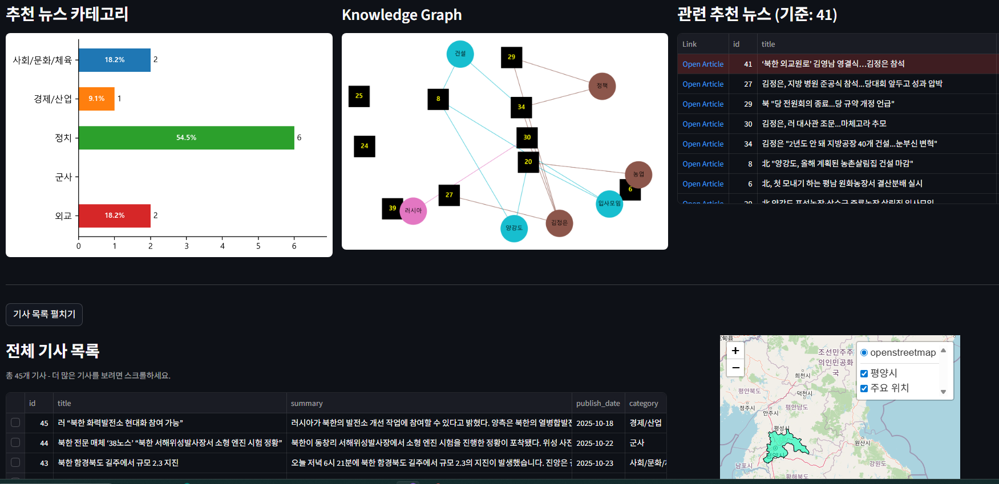

# NVISIA (North Korea Visual Insight with SIA)

## 📌 프로젝트 소개 (Project Overview)

**NVISIA**는 다양한 채널에서 쏟아지는 북한 관련 정보를 통합적으로 모니터링하고 분석하기 위한 시각화 대시보드입니다.
뉴스 기사 데이터를 수집하여 **인공지능(LLM) 기반 요약, 분류, 임베딩** 과정을 거쳐 데이터베이스에 저장하고, 이를 **Streamlit** 기반의 직관적인 웹 인터페이스로 제공합니다.

사용자는 뉴스 기사 간의 연관성을 파악하고, 지리적 정보를 지도 위에서 확인하며, 키워드 기반의 지식 그래프를 통해 북한 동향을 입체적으로 분석할 수 있습니다.

## 📊 Dashboard Preview


---

## 🚀 주요 기능 (Key Features)

*   **뉴스 데이터 자동 처리 (Data Ingestion Pipeline)**
    *   CSV 파일 업로드 시 LLM을 활용한 기사 요약 및 임베딩 생성
    *   기사 내용 기반의 자동 카테고리 분류
*   **스마트 검색 및 추천 (Search & Recommendation)**
    *   선택한 기사와 문맥적으로 유사한 Top-K 관련 뉴스 추천 (Vector Search)
    *   기사 간 연관성 분석
*   **시각화 분석 (Visual Analytics)**
    *   **Knowledge Graph**: 뉴스 키워드 및 인물 간의 관계망 시각화
    *   **Geospatial Analysis**: 기사에 언급된 지명/위치를 지도(Folium)상에 매핑
    *   **Category Trend**: 뉴스 카테고리별 분포 및 통계 시각화
*   **사용자 편의성**
    *   직관적인 Streamlit UI
    *   원본 기사 링크 연동 및 하이라이트 기능

---

## 🛠 기술 스택 (Tech Stack)

### Backend & AI
*   **Python 3.12**
*   **OpenAI API**: 텍스트 요약 및 임베딩 생성
*   **Scikit-Learn**: 데이터 분류 및 분석 (SVM, TF-IDF)
*   **PostgreSQL**: 관계형 데이터 저장
    *   **pgvector**: 벡터 유사도 검색
    *   **PostGIS**: 지리 정보(Geospatial) 데이터 처리

### Frontend & Visualization
*   **Streamlit**: 웹 대시보드 프레임워크
*   **Pyvis / NetworkX**: 지식 그래프(Knowledge Graph) 시각화
*   **Folium / Streamlit-Folium**: 지도 데이터 시각화
*   **Matplotlib**: 통계 차트

### DevOps & Tools
*   **Poetry**: 의존성 관리 및 패키징
*   **Git**: 버전 관리

---

## 📋 시작하기 (Getting Started)

### 사전 요구사항 (Prerequisites)
이 프로젝트를 실행하기 위해서는 다음 소프트웨어가 설치되어 있어야 합니다.
*   **Python 3.12+**
*   **Poetry** (Python 패키지 관리자)
*   **PostgreSQL** (with **pgvector**, **postgis** extensions enabled)

### 설치 (Installation)

1.  **레포지토리 클론**
    ```bash
    git clone https://github.com/milkpotato1000/NVISIA.git
    cd NVISIA
    ```

2.  **환경 설정 (.env)**
    프로젝트 루트 경로에 `.env` 파일을 생성하고 필요한 환경 변수를 설정하세요. (OpenAI API Key 등)
    ```env
    OPENAI_API_KEY=your_openai_api_key_here
    # 데이터베이스 설정은 현재 코드 내 설정 또는 별도 관리 필요
    ```

3.  **패키지 설치**
    Poetry를 사용하여 가상환경 생성 및 의존성을 설치합니다.
    ```bash
    poetry install
    ```

### 실행 (Usage)

1.  **데이터베이스 준비**
    *   PostgreSQL 서버가 실행 중이어야 합니다.
    *   `main.py` 또는 `src/dashboard.py` 내의 DB 접속 정보(`host`, `user`, `password`, `db`)가 로컬 환경과 일치하는지 확인하세요.

2.  **애플리케이션 실행**
    ```bash
    poetry run python main.py
    ```
    또는
    ```bash
    poetry run streamlit run src/dashboard.py
    ```

3.  **웹 대시보드 접속**
    브라우저가 자동으로 열리며, 로컬 주소(보통 `http://localhost:8501`)로 접속됩니다.
    *   홈 화면에서 뉴스 데이터 CSV 파일을 업로드하여 분석을 시작할 수 있습니다.

---

## 📂 프로젝트 구조 (Project Structure)

```
NVISIA/
├── data/                 # 데이터 파일 저장소
├── models/               # 저장된 모델 파일 (pkl 등)
├── src/                  # 소스 코드
│   ├── dashboard.py      # Streamlit 대시보드 메인 로직
│   ├── geocoder.py       # 위치 정보 처리 및 지오코딩
│   ├── knowledge.py      # 지식 그래프 생성 로직
│   ├── llmtodb.py        # LLM 처리 및 DB 적재 파이프라인
│   └── rec.py            # 뉴스 추천 시스템 로직
├── main.py               # 애플리케이션 실행 엔트리포인트
├── pyproject.toml        # Poetry 프로젝트 설정 및 의존성
└── README.md             # 프로젝트 문서
```

---

## 📅 프로젝트 기간
*   **기간**: 2025. 11. 17 ~ 2026. 01. 06
*   **결과 발표**: 2025. 01. 07

## 👥 참여 인원 (Contributors)
*   **천승우**: Project Manager (PM), LLM 기반 기사 요약 파이프라인(Summarization Pipeline) 구축, Streamlit 대시보드 아키텍처 및 레이아웃
*   **손호진**: Database 구축 및 운영(DBA), App-DB 데이터 인터랙션 관리, 지리 정보 시각화(Geospatial Visualization), 파일 업로더 구현
*   **정소민**: 도메인(북한) 기반 데이터 검증 및 평가(Domain Validation), 사용자 경험(UX) 관점의 추천 시스템 평가
*   **전용현**: 뉴스 분류 모델(Classification Model) 학습 및 성능 평가, Knowledge Graph 레이아웃 및 시각화 구현

---

## 📜 라이선스 (License)
*This project is licensed under the terms of the NVISIA license.*